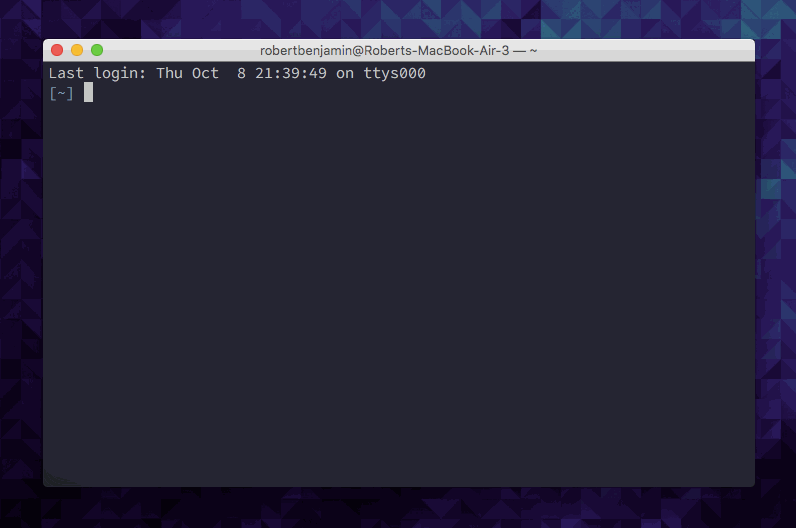

# Tiny Update

This is a tiny script for updating (and cleaning up) Brew, RubyGems, your actual gems and Node with one terminal command.



## To Install

```Shell
# Place update.sh somewhere safe
# Create a symlink to your bin folder with:

ln -s /path/to/script/update.sh /usr/local/bin/your-command-name-here

# Then, navigate to the location of the actual script in the terminal 
# (not the symlink) and run the following to give permission:

chmod +x update.sh
```

That's it! Typing the command name you specified above will run the script.